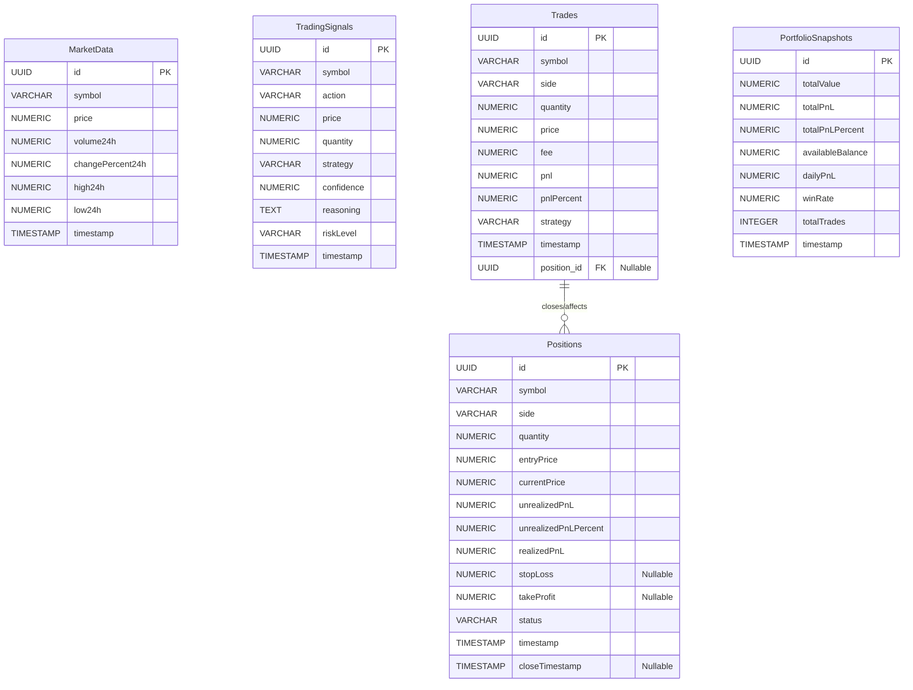

# Diseño de Base de Datos y ERD (Conceptual) - Bot_Arbitraje2105

## 1. Estado Actual de Persistencia de Datos

Basado en los archivos proporcionados, el Bot_Arbitraje2105, en su implementación actual del `TradingEngine` en `enhanced_production_server.py`, **mantiene la mayoría de sus datos operativos en memoria RAM**. Esto incluye el estado del portfolio, los trades ejecutados, las posiciones abiertas, las señales generadas y los datos de mercado en tiempo real.

*   **Volatilidad de Datos**: Los datos se pierden al reiniciar el servidor, lo que es una limitación significativa para el análisis histórico, la auditoría y la recuperación de estado después de fallos.
*   **Indicadores de Persistencia Futura**: La existencia de la carpeta `src/infrastructure/database/` y la mención de `supabase_client.py` en los módulos del dashboard (`src/core/dashboard/supabase_client.py`, `src/dashboard/supabase_client.py`) sugieren una intención de utilizar **Supabase (PostgreSQL)** para la persistencia de datos, al menos para el dashboard y posiblemente para el bot principal.

## 2. Modelos de Datos para Persistencia (Inferidos de Pydantic)

Los modelos Pydantic utilizados en la API (`MarketData`, `TradingSignal`, `Position`, `Trade`, `Portfolio`) son una excelente base para definir el esquema de una base de datos relacional. A continuación, se presenta un ERD conceptual inferido de estos modelos, asumiendo una base de datos PostgreSQL.

### 2.1. Entidades y Atributos

*   **`MarketData` (Datos de Mercado Históricos)**
    *   `id` (PK, UUID/Serial)
    *   `symbol` (VARCHAR)
    *   `price` (NUMERIC)
    *   `volume24h` (NUMERIC)
    *   `changePercent24h` (NUMERIC)
    *   `high24h` (NUMERIC, NULLABLE)
    *   `low24h` (NUMERIC, NULLABLE)
    *   `timestamp` (TIMESTAMP WITH TIME ZONE, Index)
    *   *Nota*: Podría ser una tabla de series temporales.

*   **`TradingSignals` (Señales de Trading Generadas)**
    *   `id` (PK, UUID)
    *   `symbol` (VARCHAR)
    *   `action` (VARCHAR - 'BUY', 'SELL', 'HOLD')
    *   `price` (NUMERIC)
    *   `quantity` (NUMERIC, NULLABLE)
    *   `strategy` (VARCHAR)
    *   `confidence` (NUMERIC)
    *   `reasoning` (TEXT)
    *   `riskLevel` (VARCHAR)
    *   `timestamp` (TIMESTAMP WITH TIME ZONE, Index)

*   **`Trades` (Trades Ejecutados)**
    *   `id` (PK, UUID)
    *   `symbol` (VARCHAR)
    *   `side` (VARCHAR - 'BUY', 'SELL')
    *   `quantity` (NUMERIC)
    *   `price` (NUMERIC)
    *   `fee` (NUMERIC)
    *   `pnl` (NUMERIC)
    *   `pnlPercent` (NUMERIC)
    *   `strategy` (VARCHAR)
    *   `timestamp` (TIMESTAMP WITH TIME ZONE, Index)
    *   `position_id` (FK a `Positions.id`, NULLABLE si el trade no cierra una posición)

*   **`Positions` (Posiciones Abiertas/Cerradas)**
    *   `id` (PK, UUID)
    *   `symbol` (VARCHAR)
    *   `side` (VARCHAR - 'LONG', 'SHORT')
    *   `quantity` (NUMERIC)
    *   `entryPrice` (NUMERIC)
    *   `currentPrice` (NUMERIC)
    *   `unrealizedPnL` (NUMERIC)
    *   `unrealizedPnLPercent` (NUMERIC)
    *   `realizedPnL` (NUMERIC)
    *   `stopLoss` (NUMERIC, NULLABLE)
    *   `takeProfit` (NUMERIC, NULLABLE)
    *   `status` (VARCHAR - 'OPEN', 'CLOSED')
    *   `timestamp` (TIMESTAMP WITH TIME ZONE - tiempo de apertura)
    *   `closeTimestamp` (TIMESTAMP WITH TIME ZONE, NULLABLE - tiempo de cierre)

*   **`PortfolioSnapshots` (Instantáneas del Portfolio)**
    *   `id` (PK, UUID/Serial)
    *   `totalValue` (NUMERIC)
    *   `totalPnL` (NUMERIC)
    *   `totalPnLPercent` (NUMERIC)
    *   `availableBalance` (NUMERIC)
    *   `dailyPnL` (NUMERIC)
    *   `winRate` (NUMERIC)
    *   `totalTrades` (INTEGER)
    *   `timestamp` (TIMESTAMP WITH TIME ZONE, Index)
    *   *Nota*: Esta tabla sería útil para el seguimiento del rendimiento a lo largo del tiempo.

## 3. Diagrama Entidad-Relación (ERD Conceptual)

## 4. Consideraciones de Implementación de Base de Datos

*   **Elección de la Base de Datos**: La mención de Supabase sugiere PostgreSQL, que es una excelente opción para este tipo de datos relacionales y series temporales.
*   **ORM/ODM**: Para interactuar con la base de datos desde Python, se necesitaría un ORM (Object-Relational Mapper) como SQLAlchemy o un ODM (Object-Document Mapper) si se optara por una base de datos NoSQL.
*   **Migraciones**: Se requeriría un sistema de migraciones (e.g., Alembic para SQLAlchemy) para gestionar los cambios en el esquema de la base de datos de manera controlada.
*   **Persistencia de Estado**: Implementar la lógica para guardar y cargar el estado del `TradingEngine` (portfolio, trades, posiciones, señales) en la base de datos al inicio y cierre del servidor, y periódicamente durante la ejecución.
*   **Optimización de Consultas**: Para datos de mercado y trades históricos, se necesitarían índices adecuados y posiblemente particionamiento de tablas para optimizar el rendimiento de las consultas.

## Problema: Falta de persistencia de datos del `TradingEngine`
El estado actual del `TradingEngine` (portfolio, trades, posiciones, señales) se mantiene en memoria, lo que resulta en la pérdida de datos al reiniciar el servidor. Esto impide el análisis histórico, la auditoría y la recuperación de estado.
#Solución: Implementar Persistencia de Base de Datos
Integrar una base de datos (como PostgreSQL a través de Supabase) para persistir el estado del `TradingEngine`. Esto implicaría:
1.  Definir los modelos de base de datos correspondientes a los modelos Pydantic.
2.  Utilizar un ORM para interactuar con la base de datos.
3.  Implementar lógica para guardar el estado del `TradingEngine` periódicamente y al cierre del servidor.
4.  Implementar lógica para cargar el estado del `TradingEngine` desde la base de datos al inicio del servidor.
5.  Considerar la implementación de un sistema de migraciones para gestionar los cambios en el esquema de la base de datos.
